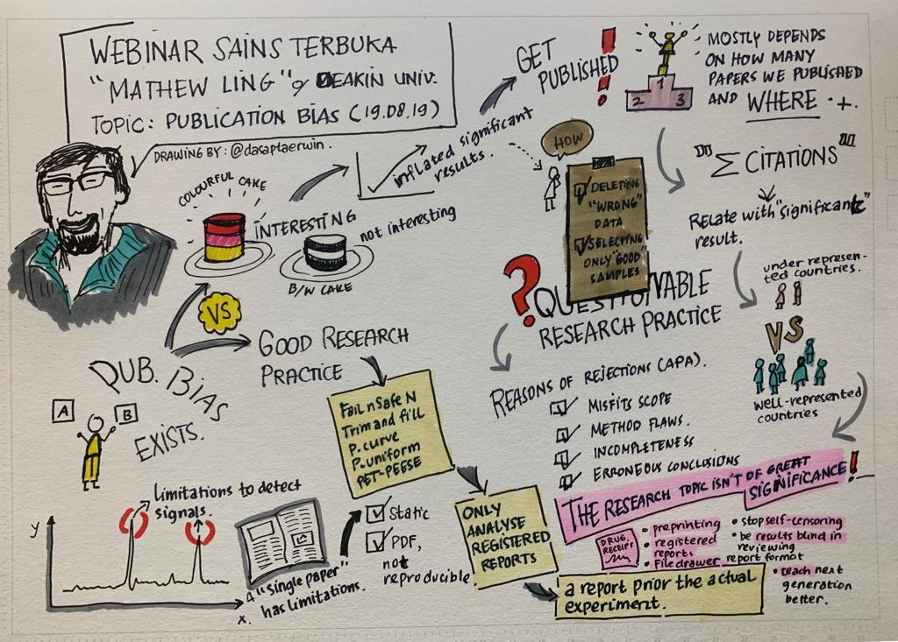
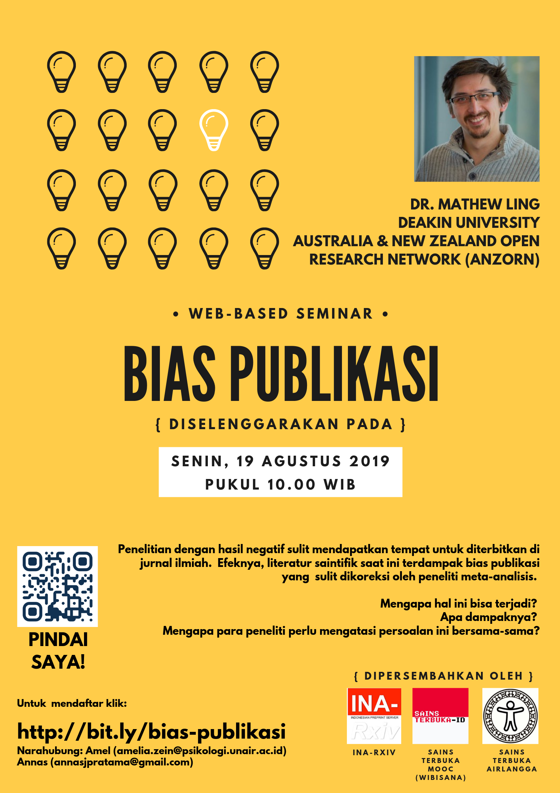

```{r setup, include=FALSE}
knitr::opts_chunk$set(echo = TRUE)
library("htmltools")
library("vembedr")
```

# Publication Bias Webinar (Monday, 18 August 2019, 10.00 WIB/13.00 AEST)

## Aims
This webinar aims to familiarise Indonesian researchers with publication bias and meta-research. Systematic review and meta-analysis are rarely seen in Indonesian scientific discourse, while those might offer a better evidence and insight than a single study. By organising this webinar, we hope to cover some introductory questions related to publication bias which are including:

* Why does a single empirical study offer such a limited insight?
* What is publication bias?
* Why does it matter?
* How could it happen?
* ..and why researchers should solve this problem together?

The main idea of this webinar is spreading 'a sense' that science is in crisis and therefore reformation is desperately needed. We will amplify this 'sense of crisis' by organising a follow-up webinar in September (Replication Crisis by Lysander James) and 'resolve the tension' by organising another (and larger) webinar in October (Advancing Science by Practicing Open Scientific Practices - in collaboration with Center for Open Science).


## Signing-up
We're currently advertising the webinar through IMs and social media and hoping to expand the coverage, despite the limited capacity of hosting. Anyone who is interested in joining needs to sign-up through [Google Forms](https://bit.ly/bias-publikasi). We also provide [FAQs and a technical guide to join a webinar](https://sainsterbukaua.github.io/id/post/petunjuk-webinar/) in our website in order to anticipate technical problems prior to the event. 


## Potential participants' profiles
Per 14 August (15:04 WIB), we have 55 potential participants who have signed up to join the webinar. Participants are mostly researchers/full-time lecturers, working at various universities in Indonesia. Participants are concentrated in Java (the most populous island), but we're currently working to expand the coverage to the outer islands.

Most participants (60%) admitted that they never conduct meta-research, but have heard about it and might be doing it in the future. Additionaly, 29.1% never heard about meta-research, but are very interested in learning more. A small fraction of participants (9.1%) said they had conducted meta-analysis before.


## How we do the webinar
We're going to use Zoom's conference call (not webinar feature), so the room is limited only to 100 participants. Amelia will send invitation to all participants and the presenter (Dr Mathew Ling). Webinar format is not something that everyone is familiar to, so moderators (Erwin, Amelia, Ilham, and Annas) will work together to help solving technical glitches and to break language barrier.


## Webinar structure
| AEST      | WIB      | Length     | Schedule                    | Presenter/Moderator           |
| --------- | :------- | :--------- | :-------------------------- | :---------------------------- |
| 12.45     | 09.45    | 15 minutes | Opening the room and helping to fix technical problems | Amelia & Ilham |
| 13.00     | 10.00    | 5 minutes  | Welcoming everyone and introducing Mathew to participants (mostly in Bahasa Indonesia, but Amelia will sum up in English via chatroom) | Erwin |
| 13.05     | 10.05    | 30 minutes | Main topic                  | Mathew Ling (Amelia and Erwin will sum up Mathew's talk in Bahasa Indonesia. Erwin will be drawing a visual note, while Amelia will be writing a short summary via chatroom) |
| 13.35     | 10.35    | 15 minutes | Q&A session (participants will raise their questions via chatroom) | Mathew (Amelia and Annas will select questions and translate those to Mathew, and Erwin will sum up Mathew's answers via chatroom) |
| 13.50     | 10.50    | 10 minutes | Closing and advertising upcoming webinars | Amelia |


## Recorded Webinar

```{r, echo = TRUE}
embed_youtube("eYzjBP4_YTM")
```


## Slides, visual notes, and chat transcript

[Click here to download the slides](https://osf.io/fz2hn/)

[Click here to download the chat transcript](https://github.com/sainsterbukaUA/webinar-impromptu/blob/master/pub-bias/meeting_saved_chat.txt)

<center></center>


## Event Poster

<center></center>